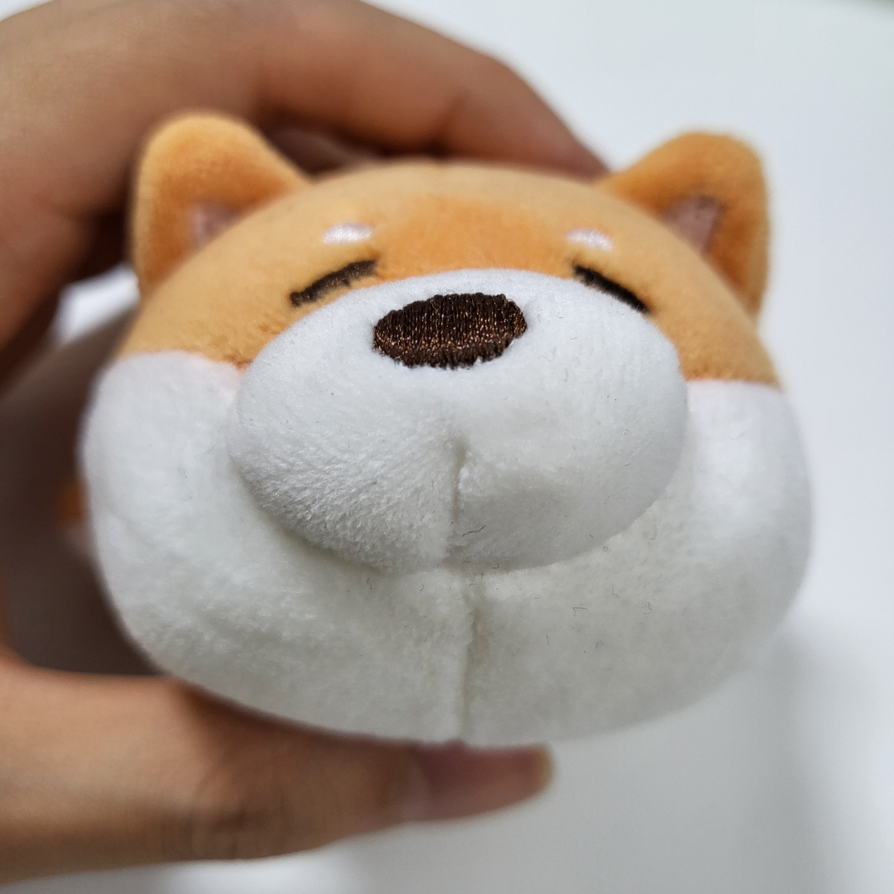

### 소감

싸피 1학기 대부분을 함께한 자바 알고리즘 스터디. 여전히 초라한 실력이긴 하지만 알고리즘 공부를 처음 시작했을 때와 지금이랑 비교해보면 정말 많이 잘해진 것 같네요
   
언젠가 기한이 코앞이고 문제풀기가 너무 힘들었던 적도 있었지만 같이 열심히 풀어준 여러분 덕분에 끝까지 잘 마무리 할 수 있지 않았나 싶습니다.
   
스터디 후기를 적고 있자니 처음 모여서 나주곰탕 먹었을 때가 떠오르네요. 정말 어색했었는데 많이 친해진 것 같아 좋습니다ㅋㅋㅋㅋ
   
알고리즘 다들 어려워 할 때 물어볼 곳이 있어서 좋았던 기철 선생님께 감사하고 요즘 과자 많이 뺏어먹는데 다음번엔 제가 사겠습니다. 항상 첨단도시 신문물을 소개해준 하림씨도 감사합니다. 덕분에 맛있는 음식 많이 먹었네요. 항상 잘먹는 연지누나 볼 때마다 뭔가 흐뭇한 느낌..나중에 자식이 생기면 이런 느낌일까요? 마지막으로 어디 갈 때 마다 운전하느라 고생한 가람누나 스터디장 너무 잘 해줘서 고맙습니다!! 

</img>

